# Architecture Diagram

## Textual Overview

The platform is a single AWS us-east-1 deployment:

1. **VPC (10.0.0.0/16)** with 3 public subnets (10.0.1-3.0/24) and 3 private subnets (10.0.11-13.0/24) across us-east-1a/b/c. Internet Gateway for public subnets, one NAT Gateway per AZ for private subnets.

2. **EKS Cluster (eks-arc-runner-platform)** on Kubernetes 1.29, with a managed node group of t3.medium instances (min 2, max 6, desired 3) in the private subnets. OIDC provider enables IRSA for fine-grained pod-level IAM.

3. **Actions Runner Controller (arc-system namespace)** watches the GitHub API for queued workflow jobs and creates ephemeral runner Pods in the `arc-runners` namespace. The `HorizontalRunnerAutoscaler` scales 1–20 runners based on queued+in-progress jobs.

4. **AWS Load Balancer Controller (kube-system)** provisions an internet-facing ALB for the Spring Boot Ingress resource.

5. **Spring Boot App (default namespace)** deployed via Helm with a Deployment, ClusterIP Service, ALB Ingress, HPA (CPU 70%, 1–5 pods), and ServiceAccount annotated with IRSA.

6. **ECR (spring-boot-app)** stores the Spring Boot Docker images. Scan-on-push enabled.

7. **CloudWatch** receives EKS control plane logs (`/eks/eks-arc-runner-platform`), Container Insights metrics, and has a CPU alarm on the node group.

8. **IAM** uses IRSA (IAM Roles for Service Accounts) via OIDC for the ALB Controller, Cluster Autoscaler, and Spring Boot app — no node-level IAM credentials are shared across workloads.

---

## Mermaid Diagram

```mermaid
graph TB
    subgraph Internet
        GH["&#x1F4BB; GitHub Actions"]
        DEV["&#x1F464; Developer"]
    end

    subgraph AWS["AWS us-east-1"]
        subgraph VPC["VPC 10.0.0.0/16"]
            IGW[Internet Gateway]
            subgraph PublicSubnets["Public Subnets (1a/1b/1c)"]
                NAT["NAT Gateways x3"]
                ALB["Application Load Balancer"]
            end
            subgraph PrivateSubnets["Private Subnets (1a/1b/1c)"]
                subgraph EKS["EKS Cluster &#40;eks-arc-runner-platform&#41;"]
                    CP["Control Plane\nKubernetes 1.29"]
                    subgraph NG["Managed Node Group\nt3.medium x2-6"]
                        subgraph ARCS["Namespace: arc-system"]
                            ARC["Actions Runner\nController"]
                        end
                        subgraph ARCR["Namespace: arc-runners"]
                            R1["Runner Pod\n(ephemeral)"]
                            R2["Runner Pod\n(ephemeral)"]
                            RN["... up to 20"]
                        end
                        subgraph DEFAULT["Namespace: default"]
                            SB["Spring Boot App\n(2 replicas)"]
                        end
                        subgraph KS["Namespace: kube-system"]
                            ALBC["ALB Controller"]
                            MS["Metrics Server"]
                        end
                    end
                end
            end
        end

        ECR["ECR\nspring-boot-app"]
        CW["CloudWatch\nLogs + Insights"]
        IAM["IAM / IRSA\nOIDC Provider"]
    end

    %% Flows
    GH -->|"webhook / API"| ARC
    ARC -->|"spawn"| R1
    ARC -->|"spawn"| R2
    R1 -->|"runs-on: self-hosted\nbuild + push"| ECR
    R2 -->|"helm upgrade"| SB
    DEV -->|"HTTP"| IGW --> ALB --> SB
    ALB --> ALBC
    SB --> CW
    EKS --> CW
    R1 -.->|"IRSA"| IAM
    SB -.->|"IRSA"| IAM
    ALBC -.->|"IRSA"| IAM
    NG --> NAT --> IGW
```

---

## Component Details

| Layer | Resource | Details |
|-------|----------|---------|
| Network | VPC | 10.0.0.0/16, DNS enabled |
| Network | Public Subnets | 10.0.1/2/3.0/24, tag `kubernetes.io/role/elb=1` |
| Network | Private Subnets | 10.0.11/12/13.0/24, tag `kubernetes.io/role/internal-elb=1` |
| Network | NAT Gateway | One per AZ for high availability |
| Compute | EKS | v1.29, public+private API endpoint |
| Compute | Node Group | t3.medium, AL2, 2-6 nodes, Cluster Autoscaler tagged |
| Identity | OIDC | Per-pod IAM via IRSA |
| Runners | ARC | v0.23.7 Helm chart, arc-system namespace |
| Runners | RunnerDeployment | Ephemeral, summerwind/actions-runner:latest |
| Runners | HRA | Scales 1–20 on queued+in-progress jobs |
| App | Spring Boot | Java 21, Gradle, 3 endpoints + Actuator |
| App | Helm Chart | Deployment + Service + Ingress + HPA + ConfigMap |
| Storage | ECR | spring-boot-app, scan-on-push, lifecycle policy |
| Observability | CloudWatch | Log group 30d retention, Container Insights |
