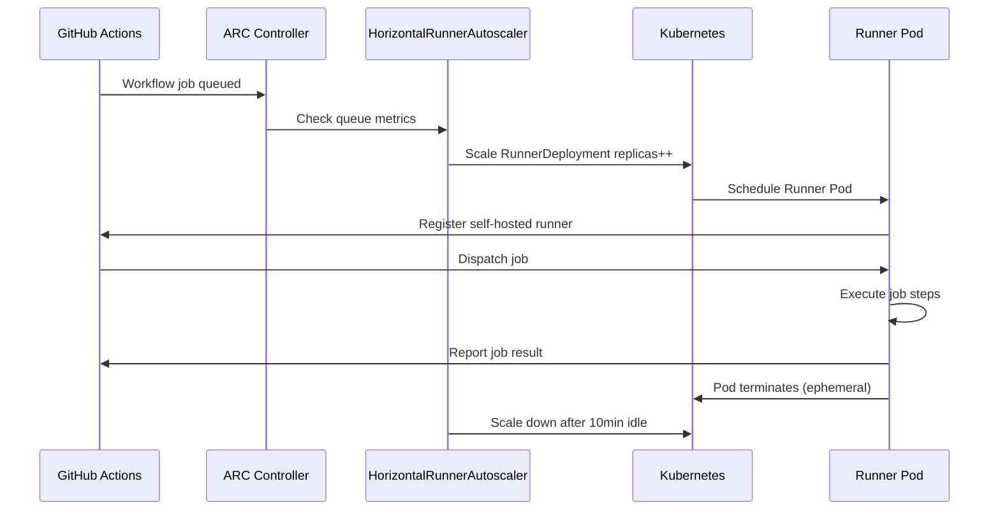

# CI/CD Pipeline Diagram

Both pipelines run **entirely on self-hosted Kubernetes runners** (ARC ephemeral pods).

---

## Build and Deploy Pipeline (`.github/workflows/build.yml`)

Triggered by: push to `main` or `workflow_dispatch`

```mermaid
flowchart TD
    START(["&#x1F680; Trigger\npush to main / dispatch"])

    subgraph JOB1["Job: build &#40;self-hosted&#41;"]
        S1["1. actions/checkout@v4"]
        S2["2. Set up Java 21 Temurin"]
        S3["3. Gradle Build\n./gradlew build -x test"]
        S4["4. Checkstyle\n./gradlew checkstyleMain"]
        S5["5. PMD\n./gradlew pmdMain"]
        S6["6. SpotBugs\n./gradlew spotbugsMain"]
        S7["7. JUnit Tests\n./gradlew test"]
        S8["8. JaCoCo Coverage\njacocoTestReport + jacocoTestCoverageVerification\n&#40;min 70% line coverage&#41;"]
        S9["Upload test reports artifact"]
    end

    subgraph JOB2["Job: publish &#40;self-hosted&#41; \u2014 needs: build"]
        P1["actions/checkout@v4"]
        P2["Configure AWS credentials\n&#40;OIDC via aws-actions&#41;"]
        P3["Login to Amazon ECR"]
        P4["9. Docker Build\ndocker build -t ECR_REGISTRY/spring-boot-app:SHA"]
        P5["10. Docker Push\ndocker push ECR_REGISTRY/spring-boot-app:SHA"]
    end

    subgraph JOB3["Job: deploy &#40;self-hosted&#41; \u2014 needs: publish"]
        D1["actions/checkout@v4"]
        D2["Configure AWS credentials"]
        D3["aws eks update-kubeconfig"]
        D4["11. Helm Upgrade\nhelm upgrade --install spring-boot-app"]
        D5["12. Verify Rollout\nkubectl rollout status deployment/spring-boot-app"]
        D6["Print ALB URL"]
    end

    END(["&#x2705; Deploy Complete\nApp live at ALB URL"])

    START --> S1
    S1 --> S2 --> S3 --> S4 --> S5 --> S6 --> S7 --> S8 --> S9
    S9 --> P1
    P1 --> P2 --> P3 --> P4 --> P5
    P5 --> D1
    D1 --> D2 --> D3 --> D4 --> D5 --> D6
    D6 --> END
```

---

## Validation Pipeline (`.github/workflows/validate.yml`)

Triggered by: successful completion of Build and Deploy, or `workflow_dispatch`

```mermaid
flowchart TD
    START(["&#x1F4E1; Trigger\nworkflow_run completed / dispatch"])

    subgraph GUARD["Guard: only on build success"]
        G1{"build.yml\nconclusion = success?"}
    end

    subgraph JOB["Job: validate &#40;self-hosted&#41;"]
        V0["actions/checkout@v4"]
        V00["Configure AWS credentials"]
        V000["aws eks update-kubeconfig"]
        VA["Resolve APP\_URL\n&#40;from input or Ingress hostname&#41;"]

        subgraph S1P["Stage 1: Smoke Test"]
            SM["curl -f APP_URL/health\n&#40;retry 18x with 10s delay&#41;"]
        end

        subgraph S2P["Stage 2: REST Assured"]
            RA1["Set up Java 21"]
            RA2["./gradlew integrationTest\n&#40;REST Assured hits /, /health, /hello&#41;"]
        end

        subgraph S3P["Stage 3: k6 Load Test"]
            K1["Install k6"]
            K2["k6 run tests/k6/load-test.js\n100 VUs &#215; 30s\nSLO: p95 &lt; 500ms"]
        end

        subgraph S4P["Stage 4: Deployment Verification"]
            DV1["kubectl get pods -n default"]
            DV2["kubectl get ingress -n default"]
            DV3["Assert all pods = Running"]
        end

        subgraph S5P["Stage 5: Generate HTML Report"]
            R1["Set up Python 3.11"]
            R2["python generate_report.py\n&#40;Surefire + JaCoCo + k6 &#x2192; report.html&#41;"]
            R3["Upload report artifact\n&#40;retained 30 days&#41;"]
        end
    end

    END(["&#x2705; Validation Complete\nHTML report uploaded as artifact"])
    SKIP(["&#x23ED; Skipped\nbuild did not succeed"])

    START --> G1
    G1 -->|yes| V0
    G1 -->|no| SKIP
    V0 --> V00 --> V000 --> VA
    VA --> SM
    SM --> RA1 --> RA2
    RA2 --> K1 --> K2
    K2 --> DV1 --> DV2 --> DV3
    DV3 --> R1 --> R2 --> R3
    R3 --> END
```

---

## Runner Lifecycle

